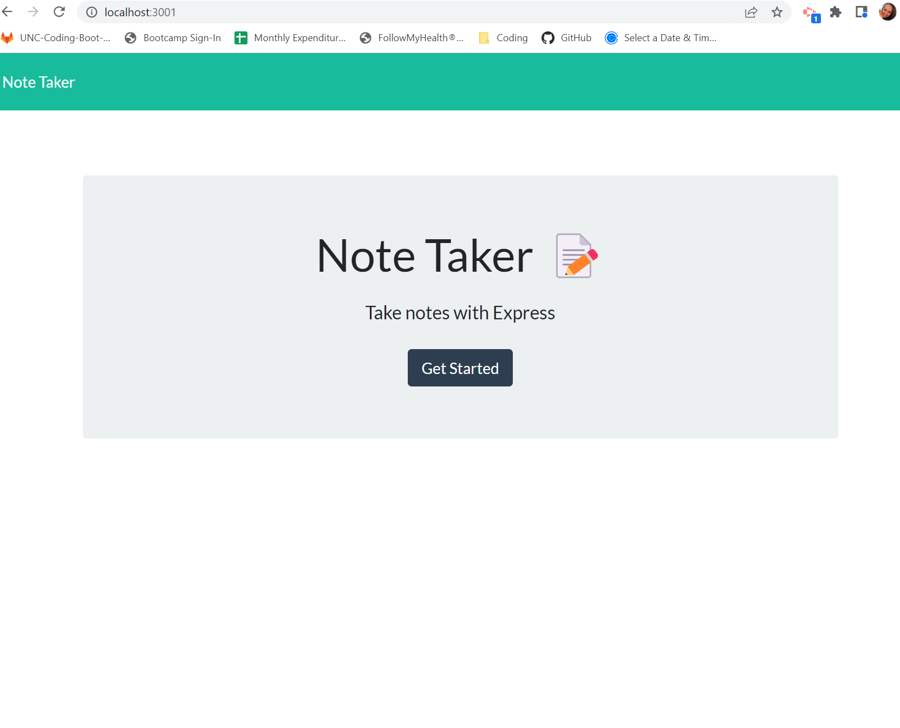
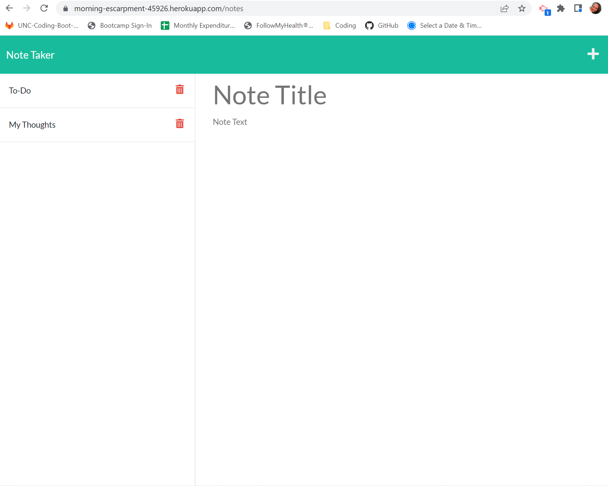

# Note-Taker


## Description

The Note Taker was created for a small business owner. The application allows the user to write and save notes so that they can organize their thoughts and keep track of the tasks they need to complete.

The following were the requirements of the project:
- When the user opens the application, they are presented with the landing page and a button to direct them to the notes page.
- When the user clicks on the button to the notes page (or puts "/notes" at the end of their query), they are routed to the notes page, which has the existing notes in the left-hand column and empty fields to enter a new note's title and text in the right-hand column.
- When the user enters a new note title and the note's text, a save icon appears in the navigation at the top of the page.
- When the user clicks the save icon, the new note is saved and appears in the left-hand column with the other existing notes.
- When the user clicks on a note in the left-hand column, the title and text appear in the right-hand column.
- When the user clicks on the plus icon in the navigation at the top of the page, the user is presented with empty fields to enter a new note title and the note's text in the right-hand column.

The application also needed to have a db.json file for the back end data, HTML routes (/, /notes), and API routes (GET and POST for api/notes).

## Table of Contents
- [Installation](#installation)
- [Links](#links)
- [Usage](#usage)
- [License](#license)
- [How to Contribute](#how-to-contribute)
- [Questions](#questions)

## Installation
Visit the GitHub repository, Note-Taker (see the link below), to fork and clone the repository. The JSON file will have the necessary dependencies. Use:
````````````
npm install
````````````
The .gitignore file is set up in the root directory along with the server.js file that contains the app.listen for the PORT, the middleware, and the imports for the routes. The routes folder contains two folders, the apiRoutes and the htmlRoutes folders. The apiRoutes folder contains the index.js as a route hub and notesRoutes.js, which contains the functions import and API routes. The htmlRoutes folder contains the index.js file, which contains the HTML routes. The public folder contains the front-end files (HTML for index and notes pages, CSS, and JS files). The lib folder contains the functions that the routes utilize. The helpers folder contains the uuid.js file to create a random index for each item in the database. The db folder contains the db.json that is acting as our database (even though it is a local json file).

## Links
- [GitHub Repository](https://github.com/amklenk/Note-Takerr)
- [Heroku Site Link](https://morning-escarpment-45926.herokuapp.com/)

## Usage
The following images are project screenshots.

Local Host Site (Index)


Deployed Heroku Site (Notes Page)



The application is navigable via running the server in an integrated terminal using either (right-click on file to open in integrated terminal):
`````````````````````
npx nodemon server.js
`````````````````````
(install nodemon to use the first command) or
`````````
npm start
``````````
. Running nodemon allows for code changes without needing to stop and start the server. When the server is running, visit the Heroku site (or localhost). The "Get Started" button takes you to the notes page (or with /notes query). A note is created by typing into the two entry points of the body for the note's title and text on the notes page. It is saved to the database and to the left-hand column by clicking the save button (floppy disk) Each note can be visited, but not edited, by clicking on it. Clicking the trash can on a note deletes it from the database and from the left-hand column.

## License
The badge at the top of the page shows that this project is licensed under MIT. The link for that license is shown below.
- [License: MIT](https://opensource.org/licenses/MIT)
## How to Contribute
Please fork and clone the repository and use a pull request to add or make changes to the current repository.

## Questions
Please direct any questions to amandamklenk3@gmail.com. To see more projects, visit the link below for amklenk's respository: 
- [GitHub Repository](https://github.com/amklenk)
